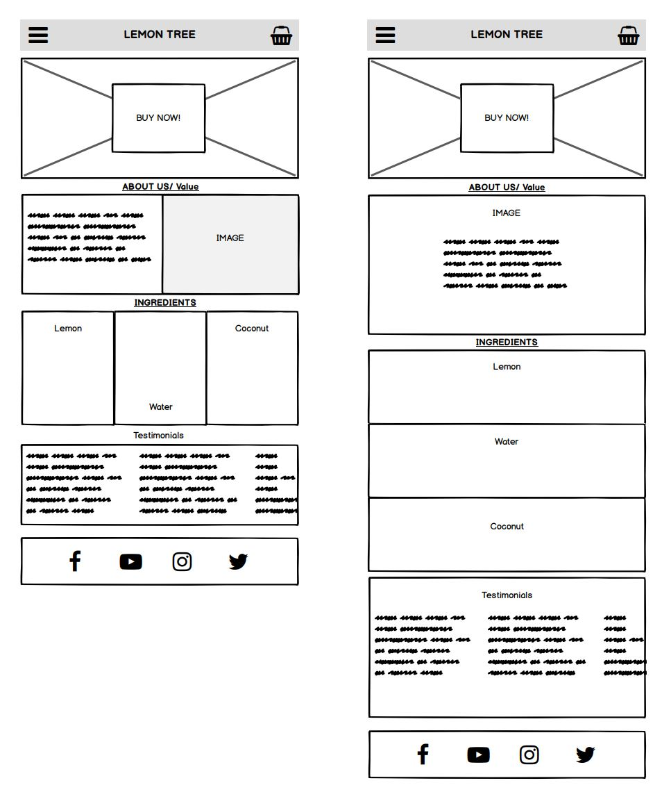

# LemonTree - The Clean lemonade company.  

In a marketplace saturated with soft drinks & energy drinks full of artificial ingredients,  
we wanted to cut through the noise and provide the consumer with the simplest/ tastiest/ 
most pure water alternative out there. Using healthier drinks to make healthier people.

The idea of this project was to provide our users both consumer and business, with an 
easy access platform to purchase our product as well as discover all the benefits lemonTree has to offer them. 

# UX

### Site owner's goal: 

To set up and e-commerce site that customers or vendors can order from directly as well 
as showcase the unique features of the product.

### External User's Goal :

The sites users are health conscious people or highend restaurants/cafe's who are looking to purchase a
cheaper, healthy, 100% green re-usable product as an alternative to mainstream soft-drinks.

### User stories :

**Clancy** is the owner of a busy highstreet-side cafe in Richmond he is known for his home made pasteries
and his cafe food is celebrated by local retail and office workers as a delicious healthy reasonably 
priced lunch option that keeps them from going to the fast food chain restaurants in the area. 
His clients love his coffee but he finds that many of them would be more inclined to visit frequently
if he had a larger variety of fresh drinks to go with his tasty sandwiches. He is presently loosing 
business to local pharmacies and offlicences which provide a range of main brand high in sugar soft drinks.

**Nancy** is a young mother of 4 she lives in a very busy area in southeast london with her husband Ralph and
their two cats Thor and loki. Running a household is a full time job and its made more difficult as she also
works part time as assitant manager of a local brewery. Her kids are all very active, take part in sport and 
often drink energy drinks to replenish after a game/session. As any mother who cares for her children's health 
she wants to make sure her kids aren't taking in energy drinks with too much caffeine or substances that could
be harmful to their development and is unsure about all the ingredients she sees when looking at the labels on
some of the drinks she finds in her local supermarket. She wants something that she can smart her kids into taking
that is both tasty and good for them.

### Wireframe

 # features

  ### index.html

 * Navigation section - Responsive navbar design which keeps its uniformity on both mobile and desktop devices.
                        featuring a collapsible hamburger menu designed with bootstrap, Company logo (centered)
                        and shopping cart icon for future e-commerce page.
 * Callout section - Full viewport background image wih centered callout text as well as call to action **Buy Now!** button.
 * About us section - Featuring mini company Bio as well as Health focused Company Ethos
 * Ingredients section - Showcasing lemontree's ingredients and unique value proposition done for transparency 
                        between company and comsumer. 
 * Testimonial section - Featuring horizontal/side scrollable range of positive feedback from past consumers.
 * Social link footer section - Providing ways to get in touch with the company through various forms of social media.

 ### purcahse.html

 * Buy for business section - the company is taking more of a hands on approach and is looking to cultivate long term 
 relationships with new businesses, which is why the form section comprises of email and phone inputs as well as a text area.
 for companies to express their interest in the product.

 * try section - As the brand is still relatively new the site is currently exhibiting a try section for consumers
 to get familiar with the product. This section features a simple address form and a call out section.

 ## Future Features to implement:

### major
 * e-commerce or online store section added to the purchasing page.
 * fix the grid in the about me section.

 ### minor
 * recognitions and comments from code sources.
 * recgonitions to images suppled from unsplash.

#Technologies used
 
## Bootstrap
Specificially its grid system to create a responsive mobile first design, simplify the positioning of certain elements of the website as well as the navbar and pre-made classes for the forms on purchase.html

## HTML  
Was used to write all the front end code on the website.

## CSS 
Used throughout and provides styling to all sections of the website.

# Testing
# Deployment

# Credits

### content
All content written was original but wikipedia was used to research The health benefits of ingredients mention on the site.
particularly this article : https://en.wikipedia.org/wiki/Coconut_sugar

Font awesome - was used to to diplay icons on the website.

Google fonts was also used to provide the styling and typography. 

### media
The photos used on the site were obtained exclusively from unsplash.com 
with special thanks to photographers:
* Alexander Krivitskiy
* Andy falconer
* Aston Graham
* Ben Sweet
* Emmanuel Ben Paul
* Jenny pace 
* Louis Hansel
* Milad Shams
* Nathan Dumlao
* Reka Biro Horvath
* Seth Doyle
* Tata Zaremba
* Zahra Owji

### acknowledgements

The whiskey drop landing page as seen in the user centric development module, as well as the coca-cola uk website were definitely the two main inspirations for the desgin of this website.
